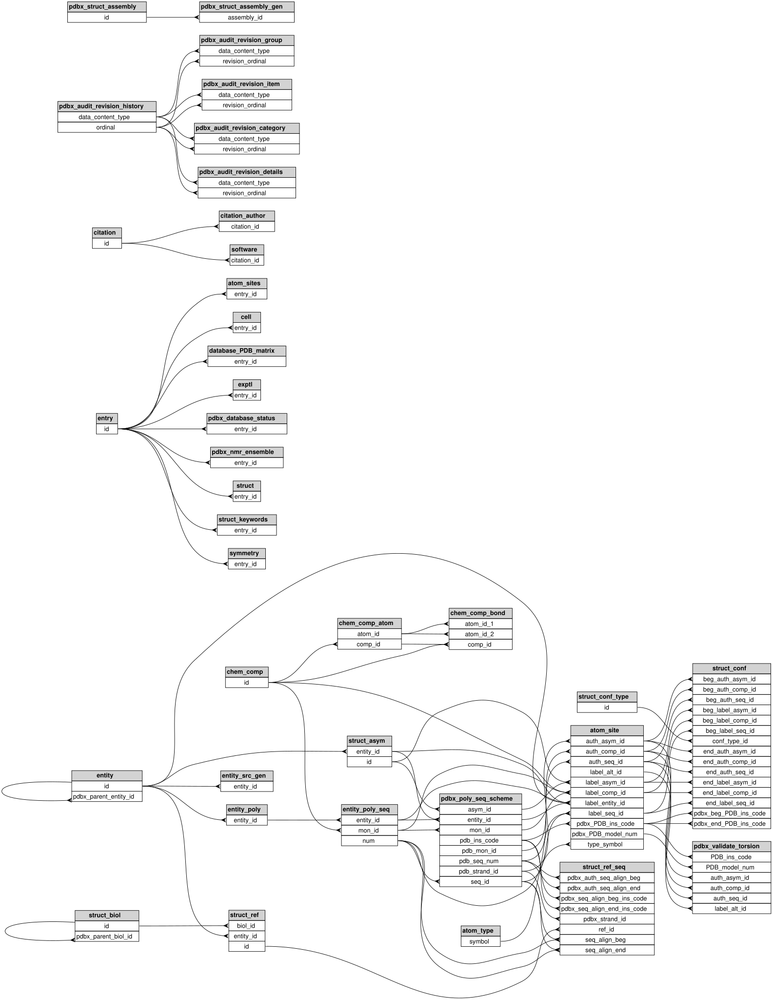

# duckdb-mmcif

Query [mmCIF](https://mmcif.wwpdb.org/) (PDBx) structural-biology files with SQL, right inside [DuckDB](https://duckdb.org/).

`ATTACH` a `.cif` file and every mmCIF category shows up as a normal DuckDB table — with column types inferred from the PDBx/mmCIF dictionary. No ETL, no schema design, no Python parsing loop: just SQL over macromolecular structure data.

## What is mmCIF?

mmCIF (also called PDBx) is the standard file format of the [Protein Data Bank](https://www.rcsb.org/) — it describes every experimentally determined macromolecular structure: proteins, nucleic acids, ligands, crystals, and all the experimental metadata behind them. A single entry is a set of *categories* (tables) such as `atom_site` (one row per atom with 3D coordinates), `entity`, `struct_ref_seq`, or `reflns` (diffraction reflections), linked by keys.

The format is powerful but awkward to analyze: files are large, syntax is quirky (multi-line fields, quoted values, `.`/`?` nulls), and joining related categories by hand is tedious. This extension turns that into plain SQL.

## Why use it?

- **Zero setup analysis** — attach a file and query it; works on your laptop, on thousands of files, or via DuckDB's S3/HTTP filesystems.
- **Typed out of the box** — column types come from the mmCIF dictionary type index, so `Cartn_x` is a `DOUBLE` and `label_seq_id` is a `BIGINT`. `.` and `?` become `NULL`.
- **Gzip support** — RCSB-style `*.cif.gz` files (e.g. `https://files.rcsb.org/download/1AMB.cif.gz`) are auto-detected and decompressed.
- **Relationships as data** — discover how categories reference each other programmatically with `mmcif_relationships()`, instead of reading the 10,000-line dictionary.
- **Fast** — built on the RCSB [`libcifpp`](https://github.com/rcsb/cifpp)-style `cpp-cif-parser` / `cpp-cif-file` core, with DuckDB's vectorized execution on top.
- **Safe by default** — attached databases are read-only unless you explicitly opt in to write mode.

## Quick start

Load the extension into a DuckDB shell started with unsigned extensions allowed:

```sh
duckdb -unsigned
```

```sql
LOAD 'mmcif.duckdb_extension';

ATTACH '1amb_updated.cif' AS mmcifdb (TYPE mmcif);
USE mmcifdb;

SHOW TABLES;                 -- every category in the file

SELECT count(*) FROM atom_site;
-- 438

SELECT type_symbol, count(*) AS n
FROM atom_site
GROUP BY 1
ORDER BY n DESC;

SELECT Cartn_x, Cartn_y, Cartn_z, type_symbol
FROM atom_site
WHERE type_symbol = 'ZN';
```

Column types are inferred from the mmCIF dictionary (`dict/mmcif_pdbx_v50_type_index.tsv.gz`):

```sql
DESCRIBE atom_site;
-- Cartn_x DOUBLE, label_seq_id BIGINT, type_symbol VARCHAR, ...
```

## Table functions

Three global table functions work without attaching anything:

```sql
-- one row per (category, column) with its inferred type
SELECT * FROM mmcif_tables('1amb_updated.cif');

-- one row per parent/child relationship, each side a (table, column) pair
SELECT * FROM mmcif_relationships('1amb_updated.cif');

-- scan a single category directly
SELECT * FROM mmcif_scan('1amb_updated.cif', 'atom_site');
```

Entity/relationship diagram of the categories in `test/data/1amb_updated.cif`, as returned by `mmcif_relationships()`:

<!-- Generated with:
    python3 scripts/mmcif_relationships_diagram.py test/data/1amb_updated.cif -f dot \
      | dot -Tsvg -o rel.svg
-->


## Read-only by default

Attached mmcif databases are read-only; data definition and mutation statements are rejected:

```sql
CREATE TABLE foo(i int);      -- Binder Error: mmcif databases are read-only - cannot CREATE TABLE
DELETE FROM atom_site;        -- Binder Error: mmcif databases are read-only - cannot DELETE
```

## Write mode

Pass `READ_WRITE TRUE` to `ATTACH` to edit the file with SQL. `INSERT`, `UPDATE`, and `DELETE` mutate the parsed `.cif` data in memory (`row_id` is the physical row index of the category table); the file is written back on `COMMIT`, `CHECKPOINT`, and `DETACH`. `ROLLBACK` re-parses the file from disk. Data definition statements (`CREATE`/`DROP`/`ALTER`) stay disabled.

```sql
ATTACH '1amb_updated.cif' AS wdb (TYPE mmcif, READ_WRITE TRUE);
USE wdb;

BEGIN;
INSERT INTO atom_site (label_atom_id, Cartn_x, type_symbol) VALUES ('O1', 3.5, 'O');
UPDATE atom_site SET type_symbol='ZZ' WHERE label_atom_id='O1';
DELETE FROM atom_site WHERE label_atom_id='O1';
COMMIT;   -- writes the mutated CifFile back to the attached .cif
```

## Examples

Ready-to-run example scripts live in [`docs/examples/`](docs/examples/):

- [`keep_chain_A.sql`](docs/examples/keep_chain_A.sql) — filters an mmCIF file down to a single auth chain (chain A of `3PLZ`, downloaded from https://files.rcsb.org/download/3PLZ.cif.gz), deleting rows in every dependent category that do not belong to that chain. Uses `mmcif_relationships()` to work out which tables reference chains.
- [`spatial_atoms.sql`](docs/examples/spatial_atoms.sql) — 3D geometry analysis of `atom_site` coordinates with the [spatial extension](https://duckdb.org/docs/stable/core_extensions/spatial/overview.html): binding-pocket residues around the `3PLZ` inhibitor, chain–chain interface contacts, hydration shell, bounding box, rigid-body transforms, and Cα trace export.

## Contributing

See [CONTRIBUTING.md](CONTRIBUTING.md) for build and test instructions.
