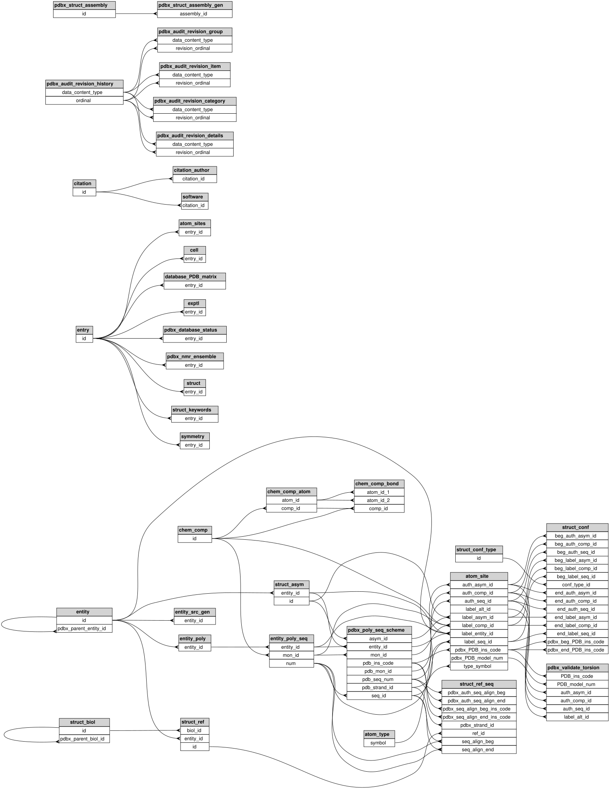

# duckdb-mmcif

[](https://doi.org/10.5281/zenodo.22771585)
[](https://www.research-software.nl/software/duckdb-mmcif)


Query [mmCIF](https://mmcif.wwpdb.org/) (PDBx) structural-biology files with SQL, right inside [DuckDB](https://duckdb.org/).

`ATTACH` a `.cif` file and every mmCIF category shows up as a normal DuckDB table — with column types inferred from the PDBx/mmCIF dictionary. No ETL, no schema design, no Python parsing loop: just SQL over macromolecular structure data.

## What is mmCIF?

mmCIF (also called PDBx) is the standard file format of the [Protein Data Bank](https://www.rcsb.org/) — it describes every experimentally determined macromolecular structure: proteins, nucleic acids, ligands, crystals, and all the experimental metadata behind them. A single entry is a set of *categories* (tables) such as `atom_site` (one row per atom with 3D coordinates), `entity`, `struct_ref_seq`, or `reflns` (diffraction reflections), linked by keys.

The format is powerful but awkward to analyze: files are large, syntax is quirky (multi-line fields, quoted values, `.`/`?` nulls), and joining related categories by hand is tedious. This extension turns that into plain SQL.

## Why use it?

- **Zero-pipeline analysis** — install as a [community extension](https://duckdb.org/community_extensions/extensions/mmcif) and start querying immediately.
- **Typed out of the box** — column types come from the mmCIF dictionary type index, so `Cartn_x` is a `DOUBLE` and `label_seq_id` is a `BIGINT`. `.` and `?` become `NULL`.
- **Gzip support** — RCSB-style `*.cif.gz` files (for example `https://files.rcsb.org/download/1AMB.cif.gz`) are auto-detected and decompressed.
- **Relationships as data** — discover how categories reference each other programmatically with `mmcif_relationships()`, instead of browsing the [mmcif dictionary website](https://mmcif.wwpdb.org/dictionaries/mmcif_pdbx_v50.dic/Categories/atom_site.html).
- **Fast** — custom cif parser/writer inspired by the [RCSB mmcif ccp libraries](https://github.com/rcsb/cpp-common), with DuckDB's vectorized execution on top.
- **Safe by default** — attached databases are read-only unless you explicitly opt in to write mode.
- **Ligands too** — Small molecules or ligand files from the [RCSB](https://www.rcsb.org) work the same way as macromolecular entries (see [Ligands](#ligands)).

## Quick start

Load the extension into a DuckDB shell started with unsigned extensions allowed:

```sh
duckdb
```
(Extension is available since v1.5.5, upgrade DuckDB if necessary.)

```sql
INSTALL mmcif FROM community;
LOAD mmcif;

ATTACH '1amb_updated.cif' AS mmcifdb (TYPE mmcif);
USE mmcifdb;

SHOW TABLES;                 -- every category in the file

SELECT count(*) FROM atom_site;
-- 438

SELECT type_symbol, count(*) AS n
FROM atom_site
GROUP BY 1
ORDER BY n DESC;

SELECT Cartn_x, Cartn_y, Cartn_z, type_symbol
FROM atom_site
WHERE type_symbol = 'ZN';
```

Column types are inferred from the mmCIF dictionary (`dict/mmcif_pdbx_v50_type_index.tsv.gz`):

```sql
DESCRIBE atom_site;
-- Cartn_x DOUBLE, label_seq_id BIGINT, type_symbol VARCHAR, ...
```

## Table functions

Five global table functions work without attaching anything:

```sql
-- one row per category with its dictionary documentation link and column count
SELECT * FROM mmcif_tables('1amb_updated.cif');

-- one row per (category, column) with its inferred type
SELECT * FROM mmcif_columns('1amb_updated.cif');

-- one row per parent/child relationship, each side a (table, column) pair
SELECT * FROM mmcif_relationships('1amb_updated.cif');

-- scan a single category directly
SELECT * FROM mmcif_scan('1amb_updated.cif', 'atom_site');
```

The category and item documentation links are also exposed as `comment` by
`duckdb_tables()` and `duckdb_columns()` for attached mmCIF databases.

Piping a file through stdin works too (like `read_csv`), for all five table functions:

```sh
cat 1amb_updated.cif | duckdb -c "SELECT * FROM mmcif_scan('/dev/stdin', 'atom_site')"
```

Entity/relationship diagram of the categories in `test/data/1amb_updated.cif`, as returned by `mmcif_relationships()`:

<!-- Generated with:
    python3 scripts/mmcif_relationships_diagram.py test/data/1amb_updated.cif -f dot \
      | dot -Tsvg -o rel.svg
-->


## Multiple files

Use `mmcif_scan` to read a category from a glob or an explicit list of paths/globs:

```sql
SELECT * FROM mmcif_scan('structures/**/*.cif.gz', 'atom_site');
SELECT * FROM mmcif_scan(['first.cif', 'more/*.cif.gz'], 'atom_site');
```

Columns match by name (case-insensitive), with dictionary types and typed `NULL`
for items missing from a file. Files without the requested category contribute
no rows. When the expanded input contains multiple files, the scan has a final
`filename VARCHAR` column containing the concrete source path, even if only one
file contains the category. A real category item named `filename` causes an error
in this case. Inputs resolving to one file keep the original schema without an
automatic `filename`.

A scan errors if no matched file contains the category, and a glob with no matches
produces DuckDB's no-files error. Gzip files work alongside plain CIF.
`data_block := 'name'` selects that block in every matched file; a file missing
that block causes an error.

`ATTACH` requires one exact file path. Multi-file access is provided by
`mmcif_scan`; the metadata functions (`mmcif_tables`, `mmcif_columns`,
`mmcif_relationships`, and `mmcif_blocks`) take one file.

To combine metadata from different categories, call `mmcif_scan` for each category
and join on `filename`. For example, resolution comes from `refine` and deposition
date from `pdbx_database_status`:

```sql
WITH resolutions AS (
    SELECT filename, min(ls_d_res_high) AS resolution
    FROM mmcif_scan('structures/**/*.cif.gz', 'refine')
    GROUP BY filename
), deposits AS (
    SELECT filename, min(recvd_initial_deposition_date::DATE) AS deposit_date
    FROM mmcif_scan('structures/**/*.cif.gz', 'pdbx_database_status')
    GROUP BY filename
)
SELECT e.filename, e.id, r.resolution, d.deposit_date
FROM mmcif_scan('structures/**/*.cif.gz', 'entry') e
LEFT JOIN resolutions r USING (filename)
LEFT JOIN deposits d USING (filename);
```

The glob should match multiple files for this filename-based join. Each queried
category must occur in at least one matched file. Aggregate categories with
multiple rows per file before joining to avoid multiplying results; left joins
retain entries missing a resolution or deposition date. A runnable version lives
in [`metadata_multiple.sql`](docs/examples/metadata_multiple.sql).

## Multiple data blocks

A file can contain multiple blocks, each beginning with `data_name` and ending
at the next block or the end of the file. List their names in file order:

```sql
SELECT * FROM mmcif_blocks('structures.cif'); -- block_name (without data_)
```

Existing functions and `ATTACH` use the first block by default. Select another
block by name (case-insensitive):

```sql
SELECT * FROM mmcif_scan('structures.cif', 'atom_site', data_block := 'model2');
SELECT * FROM mmcif_tables('structures.cif', data_block := 'model2');
SELECT * FROM mmcif_columns('structures.cif', data_block := 'model2');
SELECT * FROM mmcif_relationships('structures.cif', data_block := 'model2');
ATTACH 'structures.cif' AS model2 (TYPE mmcif, DATA_BLOCK 'model2');
```

Unknown or ambiguous block names produce an error. Gzip and remote reads support
the same selection. `READ_WRITE TRUE` edits the selected block and preserves the
other blocks verbatim.

## Ligands

Besides macromolecular entries, ligand (small molecules) files such as [ATP](https://www.rcsb.org/ligand/ATP) can be queried directly.

```sql
ATTACH 'https://files.rcsb.org/ligands/download/ATP.cif' AS liganddb (TYPE mmcif);
USE liganddb;

SELECT id, name, type, formula FROM chem_comp;
-- ATP, "ADENOSINE-5'-TRIPHOSPHATE", NON-POLYMER, "C10 H16 N5 O13 P3"
```

## Read-only by default

Attached mmcif databases are read-only; data definition and mutation statements are rejected:

```sql
CREATE TABLE foo(i int);      -- Binder Error: mmcif databases are read-only - cannot CREATE TABLE
DELETE FROM atom_site;        -- Binder Error: mmcif databases are read-only - cannot DELETE
```

## Write mode

Pass `READ_WRITE TRUE` to `ATTACH` to edit the file with SQL. `INSERT`, `UPDATE`, and `DELETE` mutate the parsed `.cif` data in memory (`row_id` is the physical row index of the category table); the file is written back on `COMMIT`, `CHECKPOINT`, and `DETACH`. `ROLLBACK` re-parses the file from disk. Data definition statements (`CREATE`/`DROP`/`ALTER`) stay disabled.

```sql
ATTACH '1amb_updated.cif' AS wdb (TYPE mmcif, READ_WRITE TRUE);
USE wdb;

BEGIN;
INSERT INTO atom_site (label_atom_id, Cartn_x, type_symbol) VALUES ('O1', 3.5, 'O');
UPDATE atom_site SET type_symbol='ZZ' WHERE label_atom_id='O1';
DELETE FROM atom_site WHERE label_atom_id='O1';
COMMIT;   -- writes the mutated tables back to the attached file
```

>[!NOTE]
>The `COMMIT` will overwrite the file you `ATTACH`-ed. Make a copy if you do not want to overwrite the original.

## Examples

Ready-to-run example scripts live in [`docs/examples/`](docs/examples/):

- [`keep_chain_A.sql`](docs/examples/keep_chain_A.sql) — filters an mmCIF file down to a single auth chain (chain A of `3PLZ`, downloaded from https://files.rcsb.org/download/3PLZ.cif.gz), deleting rows in every dependent category that do not belong to that chain. Uses `mmcif_relationships()` to work out which tables reference chains.
- [`keep_chain_D2A.sql`](docs/examples/keep_chain_D2A.sql) — keeps only chain D of `3PLZ` and renames it to chain A (in both the auth and label chain-id namespaces), producing a plain chain-A file; a copy `3PLZ_D2A.cif.gz` is edited so the original is never touched.
- [`spatial_atoms.sql`](docs/examples/spatial_atoms.sql) — 3D geometry analysis of `atom_site` coordinates with the [spatial extension](https://duckdb.org/docs/stable/core_extensions/spatial/overview.html): binding-pocket residues around the `3PLZ` inhibitor, chain–chain interface contacts, hydration shell, bounding box, rigid-body transforms, and Cα trace export.
- [`metadata_multiple.sql`](docs/examples/metadata_multiple.sql) — joins category scans by filename to extract resolution and deposition date across a collection.
- [`metadata.sql`](docs/examples/metadata.sql) — structure metadata as SQL (entry id, resolution, experimental method, software, label/auth chain mapping, residue counts, UniProt accession).
- [`secondary_structure.sql`](docs/examples/secondary_structure.sql) — helix/sheet residue counts and ratios from `struct_conf` / `struct_sheet_range`.
- [`confidence_filter.sql`](docs/examples/confidence_filter.sql) — AlphaFold pLDDT (B-iso) confidence counting and write-mode residue filtering.
- [`uniprot_mapping.sql`](docs/examples/uniprot_mapping.sql) — UniProt chain-mapping extraction and injection via `struct_ref`/`struct_ref_seq` for user authored entries or the `_pdbx_sifts_unp_segments` for sifts computed entries.

## Inspiration

This extension was inspired by
- https://github.com/DeepRank/pdb2sql - Fast and versatile biomolecular structure PDB file parser using SQL queries - made by co-worker 
- https://github.com/project-gemmi/gemmi - macromolecular crystallography library and utilities - lossy round trip via its Structure class read/write

## Contributing

See [CONTRIBUTING.md](CONTRIBUTING.md) for build and test instructions.
