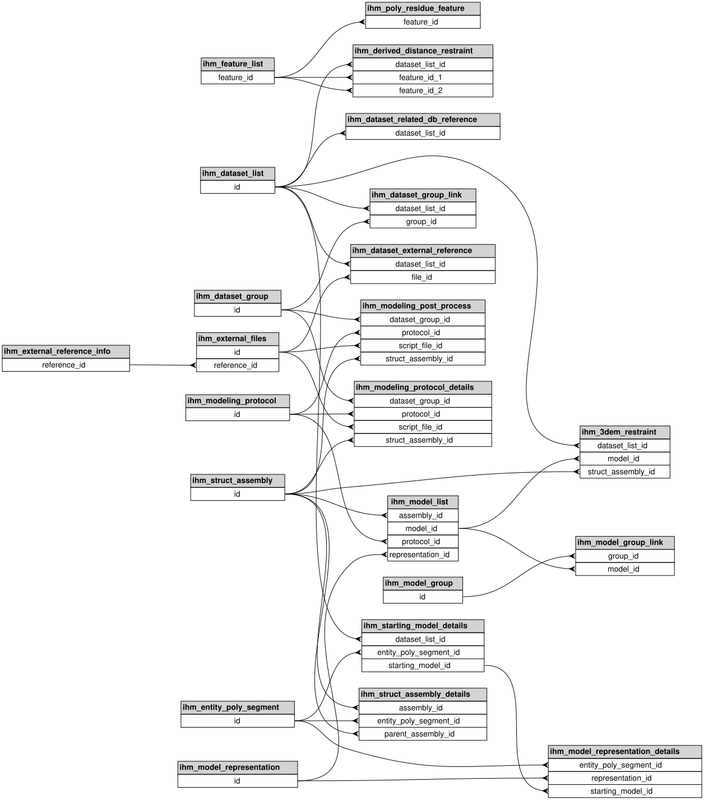
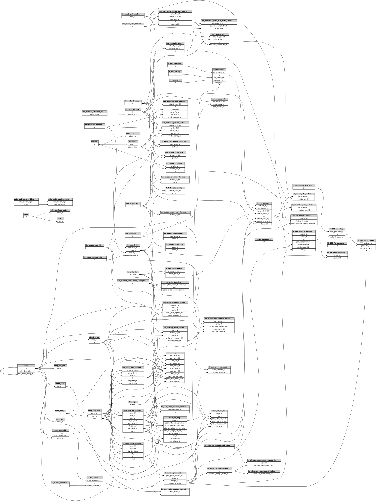
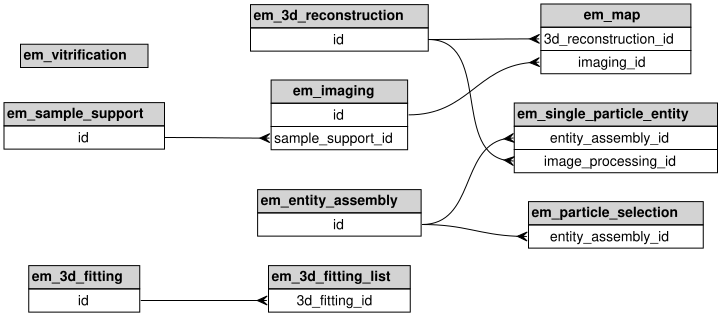

# duckdb-mmcif

[](https://doi.org/10.5281/zenodo.22771585)
[](https://www.research-software.nl/software/duckdb-mmcif)


Query [mmCIF](https://mmcif.wwpdb.org/) (PDBx) structural-biology files with SQL, right inside [DuckDB](https://duckdb.org/).

`ATTACH` a `.cif` file and every mmCIF category shows up as a normal DuckDB table — with column types inferred from the bundled PDBx/mmCIF dictionary and its supported extensions. No ETL, no schema design, no Python parsing loop: just SQL over macromolecular structure data.

## What is mmCIF?

mmCIF (also called PDBx) is the standard file format of the [Protein Data Bank](https://www.rcsb.org/) — it describes every experimentally determined macromolecular structure: proteins, nucleic acids, ligands, crystals, and all the experimental metadata behind them. A single entry is a set of *categories* (tables) such as `atom_site` (one row per atom with 3D coordinates), `entity`, `struct_ref_seq`, or `reflns` (diffraction reflections), linked by keys.

The format is powerful but awkward to analyze: files are large, syntax is quirky (multi-line fields, quoted values, `.`/`?` nulls), and joining related categories by hand is tedious. This extension turns that into plain SQL.

## Why use it?

- **Zero-pipeline analysis** — install as a [community extension](https://duckdb.org/community_extensions/extensions/mmcif) and start querying immediately.
- **Typed out of the box** — column types come from the mmCIF dictionary type index, so `Cartn_x` is a `DOUBLE` and `label_seq_id` is a `BIGINT`. `.` and `?` become `NULL`.
- **Gzip support** — RCSB-style `*.cif.gz` files (for example `https://files.rcsb.org/download/1AMB.cif.gz`) are auto-detected and decompressed.
- **Relationships as data** — discover how categories reference each other programmatically with `mmcif_relationships()`, instead of browsing the [mmcif dictionary website](https://mmcif.wwpdb.org/dictionaries/mmcif_pdbx_v50.dic/Categories/atom_site.html).
- **Fast** — custom cif parser/writer inspired by the [RCSB mmcif ccp libraries](https://github.com/rcsb/cpp-common), with DuckDB's vectorized execution on top.
- **Safe by default** — attached databases are read-only unless you explicitly opt in to write mode.
- **Ligands too** — Small molecules or ligand files from the [RCSB](https://www.rcsb.org) work the same way as macromolecular entries (see [Ligands](#ligands)).

## Quick start

Load the extension into a DuckDB shell started with unsigned extensions allowed:

```sh
duckdb
```
(Extension is available since v1.5.5, upgrade DuckDB if necessary.)

```sql
INSTALL mmcif FROM community;
LOAD mmcif;

ATTACH '1amb_updated.cif' AS mmcifdb (TYPE mmcif);
USE mmcifdb;

SHOW TABLES;                 -- every category in the file

SELECT count(*) FROM atom_site;
-- 438

SELECT type_symbol, count(*) AS n
FROM atom_site
GROUP BY 1
ORDER BY n DESC;

SELECT Cartn_x, Cartn_y, Cartn_z, type_symbol
FROM atom_site
WHERE type_symbol = 'ZN';
```

Column types are inferred from the combined dictionary (`dict/mmcif_type_index.tsv.gz`):

```sql
DESCRIBE atom_site;
-- Cartn_x DOUBLE, label_seq_id BIGINT, type_symbol VARCHAR, ...
```

## Dictionary extensions

The extension bundles the current PDBx/mmCIF v5 dictionary together with
**IHMCIF**, **flrCIF** and **3DEM**. All are available by default: no dictionary
selection or downloads are needed when opening a file.

```sql
ATTACH 'integrative_model.cif' AS model (TYPE mmcif);
SHOW TABLES FROM model;
SELECT * FROM model.ihm_model_list;
-- Or discover and scan categories without attaching:
SELECT * FROM mmcif_tables('integrative_model.cif');
SELECT * FROM mmcif_scan('integrative_model.cif', 'ihm_model_list');
```

Only categories and columns present in the selected data block are exposed.
The combined dictionary supplies types, documentation links and relationships,
including links between extension categories and base categories. Catalog
comments link to the dictionary defining each category or item. Unknown items
keep the `VARCHAR` fallback. Dictionary ranges and comma-separated integer
lists also remain `VARCHAR` so values such as `3-174` are preserved.

Shared definitions keep the current base dictionary's types and documentation;
reviewed type conflicts are recorded in [`dict/sources.json`](dict/sources.json).
That manifest also records bundled dictionary versions and source checksums.
Older and alternative base dictionaries are not bundled.

## Table functions

Five global table functions work without attaching anything:

```sql
-- one row per category with its dictionary documentation link and column count
SELECT * FROM mmcif_tables('1amb_updated.cif');

-- one row per (category, column) with its inferred type
SELECT * FROM mmcif_columns('1amb_updated.cif');

-- one row per parent/child relationship, each side a (table, column) pair
SELECT * FROM mmcif_relationships('1amb_updated.cif');

-- scan a single category directly
SELECT * FROM mmcif_scan('1amb_updated.cif', 'atom_site');
```

The category and item documentation links are also exposed as `comment` by
`duckdb_tables()` and `duckdb_columns()` for attached mmCIF databases.

Piping a file through stdin works too (like `read_csv`), for all five table functions:

```sh
cat 1amb_updated.cif | duckdb -c "SELECT * FROM mmcif_scan('/dev/stdin', 'atom_site')"
```

Entity/relationship diagram of the categories in `test/data/1amb_updated.cif`, as returned by `mmcif_relationships()`:

<!-- Generated with:
    python3 scripts/mmcif_relationships_diagram.py test/data/1amb_updated.cif -f dot \
      | dot -Tsvg -o docs/diagrams/pdbx.svg
-->


The following diagrams show only categories defined by each extension and
present in the downloaded archive example, with relationships between those
categories. The flrCIF diagram focuses on `flr_*` categories and excludes
inherited IHMCIF categories.

<details>
<summary>IHMCIF — PDB-IHM entry 8ZZE</summary>

Source: [8ZZE CIF](https://pdb-ihm.org/cif/8zze.cif).



</details>

<details>
<summary>flrCIF — FRET entry 9A08</summary>

Source: [9A08 CIF](https://pdb-ihm.org/cif/9a08.cif).



</details>

<details>
<summary>3DEM — EMDB entry EMD-4404</summary>

Source: [EMD-4404 experimental metadata](https://ftp.ebi.ac.uk/pub/databases/emdb/structures/EMD-4404/metadata/emd-4404.cif.gz).
This entry's EM categories are included in the current PDBx/mmCIF base dictionary.



</details>

See [diagram generation instructions](docs/diagrams/README.md) to regenerate these examples.

## Multiple data blocks

A file can contain multiple blocks, each beginning with `data_name` and ending
at the next block or the end of the file. List their names in file order:

```sql
SELECT * FROM mmcif_blocks('structures.cif'); -- block_name (without data_)
```

Existing functions and `ATTACH` use the first block by default. Select another
block by name (case-insensitive):

```sql
SELECT * FROM mmcif_scan('structures.cif', 'atom_site', data_block := 'model2');
SELECT * FROM mmcif_tables('structures.cif', data_block := 'model2');
SELECT * FROM mmcif_columns('structures.cif', data_block := 'model2');
SELECT * FROM mmcif_relationships('structures.cif', data_block := 'model2');
ATTACH 'structures.cif' AS model2 (TYPE mmcif, DATA_BLOCK 'model2');
```

Unknown or ambiguous block names produce an error. Gzip and remote reads support
the same selection. `READ_WRITE TRUE` edits the selected block and preserves the
other blocks verbatim.

## Ligands

Besides macromolecular entries, ligand (small molecules) files such as [ATP](https://www.rcsb.org/ligand/ATP) can be queried directly.

```sql
ATTACH 'https://files.rcsb.org/ligands/download/ATP.cif' AS liganddb (TYPE mmcif);
USE liganddb;

SELECT id, name, type, formula FROM chem_comp;
-- ATP, "ADENOSINE-5'-TRIPHOSPHATE", NON-POLYMER, "C10 H16 N5 O13 P3"
```

## Read-only by default

Attached mmcif databases are read-only; data definition and mutation statements are rejected:

```sql
CREATE TABLE foo(i int);      -- Binder Error: mmcif databases are read-only - cannot CREATE TABLE
DELETE FROM atom_site;        -- Binder Error: mmcif databases are read-only - cannot DELETE
```

## Write mode

Pass `READ_WRITE TRUE` to `ATTACH` to edit the file with SQL. `INSERT`, `UPDATE`, and `DELETE` mutate the parsed `.cif` data in memory (`row_id` is the physical row index of the category table); the file is written back on `COMMIT`, `CHECKPOINT`, and `DETACH`. `ROLLBACK` re-parses the file from disk. Data definition statements (`CREATE`/`DROP`/`ALTER`) stay disabled.

```sql
ATTACH '1amb_updated.cif' AS wdb (TYPE mmcif, READ_WRITE TRUE);
USE wdb;

BEGIN;
INSERT INTO atom_site (label_atom_id, Cartn_x, type_symbol) VALUES ('O1', 3.5, 'O');
UPDATE atom_site SET type_symbol='ZZ' WHERE label_atom_id='O1';
DELETE FROM atom_site WHERE label_atom_id='O1';
COMMIT;   -- writes the mutated tables back to the attached file
```

>[!NOTE]
>The `COMMIT` will overwrite the file you `ATTACH`-ed. Make a copy if you do not want to overwrite the original.

## Examples

Ready-to-run example scripts live in [`docs/examples/`](docs/examples/):

- [`keep_chain_A.sql`](docs/examples/keep_chain_A.sql) — filters an mmCIF file down to a single auth chain (chain A of `3PLZ`, downloaded from https://files.rcsb.org/download/3PLZ.cif.gz), deleting rows in every dependent category that do not belong to that chain. Uses `mmcif_relationships()` to work out which tables reference chains.
- [`keep_chain_D2A.sql`](docs/examples/keep_chain_D2A.sql) — keeps only chain D of `3PLZ` and renames it to chain A (in both the auth and label chain-id namespaces), producing a plain chain-A file; a copy `3PLZ_D2A.cif.gz` is edited so the original is never touched.
- [`spatial_atoms.sql`](docs/examples/spatial_atoms.sql) — 3D geometry analysis of `atom_site` coordinates with the [spatial extension](https://duckdb.org/docs/stable/core_extensions/spatial/overview.html): binding-pocket residues around the `3PLZ` inhibitor, chain–chain interface contacts, hydration shell, bounding box, rigid-body transforms, and Cα trace export.
- [`metadata.sql`](docs/examples/metadata.sql) — structure metadata as SQL (entry id, resolution, experimental method, software, label/auth chain mapping, residue counts, UniProt accession).
- [`secondary_structure.sql`](docs/examples/secondary_structure.sql) — helix/sheet residue counts and ratios from `struct_conf` / `struct_sheet_range`.
- [`confidence_filter.sql`](docs/examples/confidence_filter.sql) — AlphaFold pLDDT (B-iso) confidence counting and write-mode residue filtering.
- [`uniprot_mapping.sql`](docs/examples/uniprot_mapping.sql) — UniProt chain-mapping extraction and injection via `struct_ref`/`struct_ref_seq` for user authored entries or the `_pdbx_sifts_unp_segments` for sifts computed entries.

## Inspiration

This extension was inspired by
- https://github.com/DeepRank/pdb2sql - Fast and versatile biomolecular structure PDB file parser using SQL queries - made by co-worker 
- https://github.com/project-gemmi/gemmi - macromolecular crystallography library and utilities - lossy round trip via its Structure class read/write

## Contributing

See [CONTRIBUTING.md](CONTRIBUTING.md) for build and test instructions.
